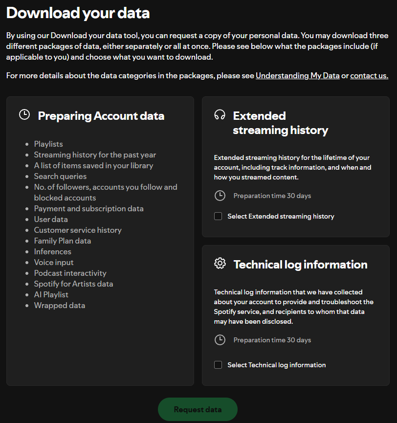
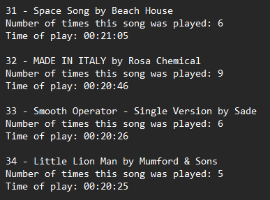

# spotify-wrapped
 This is a text-based version of the Spotify Wrapped tool. It has been coded in Java, and it allows us to examine our most listened songs during any period of time. 

It is different from Spotify Wrapped, apart from not having a cool, incredible visualisation of the data, in the fact that it allows us to specify any available period of time since Spotify had started recording the tracks we play.

The data needed to perform this can be gathered from your Spotify personal account:
- Log in to your personal account on a browser
- Go to your profile, on the top right corner, and click `Account`
- Scroll down to `Security and Privacy`, and click on `Account privacy`

At the bottom of the page, you should be able to see something like the following:

By default, when you request your data, you receive everything mentioned on the left-side column, which includes the streaming history _of the past year_. If you wish to get every track you've listened to since records began, you should click on the right-side button, `Select Extended streaming history`. And don't worry: even though it says 30 days, it doesn't take longer than a week for you to receive it.

Once you get all of the data, nice and wrapped up in a `.zip` file, there should be a folder included in it with a title similar to **Spotify (Extended) Streaming History**. This will include possibly multiple JSON files, which contain information such as the name of the track, the artist, the playing time, and the time and date of playing. What this program does is extract the information from those JSON files, and according to the time period you've specified, it gathers all of the songs that had been played during that time and wraps them up in a text file that orders them by descending total playing time.

That folder should come with a `.pdf` file that explains this JSON structure. However, what you need to know to use this program is the fact that, depending on whether you select past year or extended streaming history, the file structure changes. But don't worry: we have it covered!

After the program has been compiled, you can execute with the following arguments, in the order in which they appear here:

`<mode> <list of input files> <output file>`

- **mode**: a flag used to indicate whether we use the full streaming history (0) or just the past year (1)
- **list of input files**: the names of all the JSON files included in the folder we've just talked about
- **output file**: the name of the file you want the ordered list written into

When you execute the program, a start and end dates will be asked for you to choose the time interval. You should write them in the format dd/mm/yyyy

Once the program finishes running, your output file will look similar to this:

